# 一.单CPU模式单任务单函数

### (a):

- CPU的通用寄存器有：AX,BX,CX,DX这四个。

- 段的概念：因为8086CPU有20位地址总线，但是8086CPU又是16位结构，所以我们采取了用两个16位地址合成的方法来形成一个20位的物理地址。一个叫段地址，另一个叫偏移地址。但是实际上内存并不是分段的，我们只是可以用分段的方式来管理内存，在编程时根据需要可以将若干地址连续内存单元看成一个段。

- CS,DS,SS的作用：这三个都是段寄存器，当8086CPU要访问内存时由这四个段寄存器提供内存单元的段地址。其中一般CS用来指向代码段，DS用来指向数据段，SS用来指向栈段。

- CPU是如何从内存存取到指令的：

  - 首先将CS,IP中的内容送入地址加法器，完成到物理地址的转换
  - 地址加法器将物理地址送入输入输出控制电路
  - 输入输出控制电路将物理地址送上地址总线
  - 之后从内存里存放的指令通过数据总线被送入CPU

  这样CPU就从内存里取到了指令

### (b):

- 在mov指令中给出16位的寄存器就可以进行16位数据的传送了。比如从寄存器到内存：`mov ax,[0]`，从内存到寄存器：`mov [0],ax`，从寄存器到寄存器：`mov ax, bx`。不能实现从内存到内存的数据复制。必须通过一个寄存器作为中转。在(a)中已经大概说明了总线以及寻址方式的概念

### (c):

- 程序地址：就是由段地址：偏移地址二者构成的逻辑地址
- 物理地址：真正在物理内存中的地址，通过物理地址可以访问到我们想要的数据
- 段的概念(a)中已解释过
- 链接的概念：将所有的目标文件进行合并，所有目标文件的数据段合并到可执行文件的数据段，所有目标文件的代码段合并到可执行文件的代码段。当所有合并完成后，各个目标文件中的相对地址也就确定了。因此在这个阶段，链接器需要修正目标文件中的相对地址。

### (d):

- 可以实现对端口的读写，进而可以进行比如说对键盘系统进行相关的控制，比如从60h端口读入键盘输入的信息。还可以通过向接口写入相关信息，控制比如说网卡，显卡的工作。

- 端口的概念：在我们的PC机系统中，和CPU通过总线相连的芯片除了各种存储器外还有以下三种芯片

  - 各种接口卡上的接口芯片，它们控制接口卡进行工作
  - 主板上的接口芯片，CPU通过它们对外部设备进行访问
  - 其它芯片，用来存储相关的系统信息，或进行相关的输入输出处理

  这些芯片上都有一组可以由CPU读写的寄存器，从CPU的角度讲这些寄存器都当作端口，对它们进行统一编制。

- 控制器：控制器负责程序的流程管理，其基本功能是从内存取指令、分析指令和执行指令，常见的控制器有中断控制器，键盘控制器等。

### (e):

- 中断，异常的概念：CPU不再接着刚执行完的指令向下执行，而是转去处理接收到的特殊信息。这个特殊信息要求CPU马上进行某种处理，并向所要进行的该种处理提供了必备的参数的通知信息。异常和中断的区别在于异常是不是随机产生的，而中断是任何时间都有可能发生的，也就是说中断是不可复现的，异常是可复现的
- 中断，异常的作用：可以说操作系统是中断驱动的。中断和异常可以:
  - 提高计算机系统效率。计算机系统中处理机的工作速度远高于外围设备的工作速度。通过中断可以协调它们之间的工作。当外围设备需要与处理机交换信息时，由外围设备向处理机发出中断请求，处理机及时响应并作相应处理。不交换信息时，处理机和外围设备处于各自独立的并行工作状态。
  - 维持系统可靠正常工作。现代计算机中，程序员不能直接干预和操纵机器，必须通过中断系统向操作系统发出请求，由操作系统来实现人为干预。主存储器中往往有多道程序和各自的存储空间。在程序运行过程中，如出现越界访问，有可能引起程序混乱或相互破坏信息。为避免这类事件的发生，由存储管理部件进行监测，一旦发生越界访问，向处理机发出中断请求，处理机立即采取保护措施。
  - 满足实时处理要求。在实时系统中，各种监测和控制装置随机地向处理机发出中断请求，处理机随时响应并进行处理。
  - 提供故障现场处理手段。处理机中设有各种故障检测和错误诊断的部件，一旦发现故障或错误，立即发出中断请求，进行故障现场记录和隔离，为进一步处理提供必要的依据。

# 二.单CPU模式单任务多函数

### (a):

- 参数传递：调用函数通过寄存器来传递，调用者将参数送入相应的寄存器，如果这个寄存器之后还要使用，则要把它保存在栈上。然后被调用者通过从寄存器中去到参数，再把返回值压到相应寄存器中返回。

- 栈里面还存放着调用时的`cs`，`ip`寄存器的值。函数B运行完成后，通过`pop`栈上存放的`cs`，`ip`寄存器的值，将寄存器`cs`,`ip`指向的命令设置为调用命令的下一条指令

- `call xxx:xxx`相当于执行以下语句序列

  ```assembly
  push CS
  push IP
  jmp dword ptr 内存单元地址
  ```

  执行一个段间转移，和`jmp`的区别就在于在栈里保存了`cs`,`ip`寄存器的值

- 用了`SS`,`SP`,`BP`这几个寄存器

- 首先执行`call`，向栈中压入了`cs`,`ip`两个寄存器，之后将`cs`和`ip`的值修改，之后一步步执行指令，执行到`ret`时将`ip`和`cs`弹出栈

### (b):

- 可以传递，方式和普通函数调用一样
- 正常就是使用一个栈

### (c):

- 可以传递，方式和普通函数调用一样
- 正常就是一个栈

### (d):

- 可以用一个栈，因为题目只是要求按下B的时候运行函数B，并没有要求是接着上一次进行。这样可以直接按照嵌套的函数调用来理解，即是一个嵌套的栈段

# 三.单CPU模式多(线程)任务

### (a):

- 不能共用一个栈了。设想，如果共用一个栈，当前在运行A函数，A call了一个print函数，此时sp指向返回地址（call压栈返回地址）了。这时候按下B键，程序应当切换到B函数，B也call了一个print，然后这时候按下了A键，切换到A运行，A应该接着运行print，那么A从print返回的地址是不是正确的  

- 至少需要三个栈，每个函数用一个栈，还有一个入口栈

- 因为寄存器只有一套，毫无疑问切换到B的时候我们需要保存A的寄存器，然后从某个地方载入B的寄存器内容。重新运行A的时候，使用保存的寄存器值还原A的运行场景，即回到A被中断的那一瞬间，从而恢复运行A，好像A没有被打断一样。

  故我们需要保存2套寄存器，从而可以使得AB可以任意的来回切换。但我们怎么知道要不要切换呢，比如按下A的时候正在运行A，这时候是不必切换的，所以我们引入一个参数，记录当前正在运行的程序。

  具体分析中断处理例程的场景，首先根据按键，决定要不要切换。如果要切换的话，我们首先得保存一下寄存器，即快照，我们叫它 **save_all** 。然后恢复目标函数的运行快照，切换的工作是用一个叫**switch**的函数完成。不考虑细节的话，我们已经成功的做出来了这个程序，完美的符合要求。

  现在来探讨一些细节的东西，从 **save_all** 开始，首先我们根据按键找到储存的地方（两个函数有两个储存的地方），接下来就简单了，我们把寄存器挨个放进去就好了。

  **switch**也很简单，无非是找到储存的地方，然后修改现有的寄存器就行，这不就切换成功了么。

  我们再整理一下整体逻辑，递增程序开始运行后，运行某个函数。按下指定键时，中断例程使用save_all保存现场，然后使用switch切换到其他函数，其中包括栈的切换（通过修改ss sp完成）。然后我们就实现了两个函数无缝切换

### (b):

- 因为我们每个函数分别使用了一个栈，在函数进行切换的时候我们随机进行了栈的切换，我们在切换到另一个函数前会把当前的`CS`,`IP`压栈，这样在切换回来以后我们可以把栈里面存放的`CS`和`IP`给弹出来，这样就恢复了之前的执行状态
- A运行时发生中断，运行C，这个时候会把标志寄存器，`CS`,`IP`压入A的栈里面，然后我们在中断处理程序中将`SS:SP`切换为B的栈的，然后在把B的栈中存放的`CS`,`IP`给弹出来，这样就切换到了函数B执行

### (c):

- 是两个线程，因为他们有各自的栈和运行序列，但是因为是实模式，所以他们可以说是共享了同一份地址空间。我认为线程就是有自己的栈，有自己的寄存器上下文，但是其它大部分资源与其它线程共享此进程中的全部系统资源

- 需要做如下操作

  - 首先要申请一段内存空间(一页)
  - 创建一个`TCB`数据结构
  - 将`TCB`中的内核栈和用户栈指针分别指向相应的位置，其中内核栈在申请的页的最高地址处，用户栈与父进程共用
  - 之后将栈和`TCB`关联起来

  我认为`TCB`可以做成把一个`PCB`去除掉它的`ldt`和`cr3`以后的结构。也就是说关于内存的映射方面全都删去，这样就不用考虑不同进程的地址空间隔离的问题

- 想要退出线程的话，可以参考进程的`exit`，步骤如下

  ```c
  int sys_endthread(long code)  
  {
          int i;
  	free_page_tables(get_base(current->ldt[1]),get_limit(0x0f));
  	free_page_tables(get_base(current->ldt[2]),get_limit(0x17));
  	for (i=0 ; i<NR_TASKS ; i++)
  		if (task[i] && task[i]->father == current->pid) {
  			task[i]->father = 1;
  			if (task[i]->state == TASK_ZOMBIE)
  				/* assumption task[1] is always init */
  				(void) send_sig(SIGCHLD, task[1], 1);
  		}
  	for (i=0 ; i<NR_OPEN ; i++)
  		if (current->filp[i])
  			sys_close(i);
  	iput(current->pwd);
  	current->pwd=NULL;
  	iput(current->root);
  	current->root=NULL;
  	iput(current->executable);
  	current->executable=NULL;
  	if (current->leader && current->tty >= 0)
  		tty_table[current->tty].pgrp = 0;
  	if (last_task_used_math == current)
  		last_task_used_math = NULL;
  	if (current->leader)
  		kill_session();
  	current->state = TASK_ZOMBIE;
  	current->exit_code = code;
  	tell_father(current->father);
  	release(current);
  	return (-1);	/* just to suppress warnings */
  }
  ```

### (d):
- 构建临界区：通过使用比如信号量等同步手段，保证一次只有一个进程进入这段代码

- 条件：

  - 互斥进入
  - 空闲进入
  - 有限等待
### (e):
- **互斥锁**：互斥锁是一种简单的加锁的方法来控制对共享资源的访问，互斥锁只有两种状态,即上锁( lock )和解锁( unlock )

  **信号量**：信号量本质上是一个非负的整数计数器，它被用来控制对公共资源的访问。编程时可根据操作信号量值的结果判断是否对公共资源具有访问的权限，当信号量值大于 0 时，则可以访问，否则将阻塞。PV 原语是对信号量的操作，一次 P 操作使信号量减１，一次 V 操作使信号量加１。

  **条件变量**：条件变量是线程的另外一种同步机制，这些同步对象为线程提供了会合的场所，理解起来就是两个（或者多个）线程需要碰头（或者说进行交互-一个线程给另外的一个或者多个线程发送消息），我们指定在条件变量这个地方发生，一个线程用于修改这个变量使其满足其它线程继续往下执行的条件，其它线程则接收条件已经发生改变的信号。条件变量同锁一起使用使得线程可以以一种无竞争的方式等待任意条件的发生。所谓无竞争就是，条件改变这个信号会发送到所有等待这个信号的线程。而不是说一个线程接受到这个消息而其它线程就接收不到了。

# 四.双CPU模式单进程空间

### (a):

- 设置四个运行级的目的：可以利用特权级的比较来防止在低特权级的程序或任务访问具有较高特权级的一个段。比如操作系统代码和数据存放在要比普通应用程序具有更高特权级的段中操作系统的代码和数据。这样就在一定程度上保护了操作系统内核的代码和数据不会被随意修改。
- 为什么操作系统值用了两个运行级别：因为区分用户态和内核态就够了，多的特权级可能帮助并不是很大

### (b):

- `CS`,`DS`,`SS`这些段寄存器的可见部分中存着目标段的段选择符。然后`LDTR`的可见部分存放的也是段选择符。我们通过`LLDT`指令可以将段选择符加载到`LDTR`寄存器中
- GDT和LDT中描述符的区别：LDT中的都是特权级为3的段的段描述符，而GDT中有特权级为0的段的段描述符，并且还有中断门，调用门，陷阱门以及LDT的描述符

### (C):

- 如果没有进行段的映射，那么有可能内核空间的段可以被用户程序访问。这样用户程序就有可能可以修改内核的数据和代码，就没有起到保护。

### (d):

- 第一种方式的优点：只有一张`GDT`表，那么在切换进程以后也不用切换`LDT`了，因为所有的映射关系都存在一张表里面。但是如果都存在一个表里面一个进程就可以轻松的访问另一个进程的段，如果都是用户进程的话，他们的`CPL`和`DPL`都是3，无法进行保护，并且只用一个`GDT`表的话这个`GDT`表会非常大，难以维护
- 第二种方式的优点，一个进程通过自己的`LDT`表只能找到本进程的段，找不到其他进程的段。这样就在一定程度上实现了进程之间的隔离

### (e):

- 对于第一种方案，没有别的方法只能增加到`GDT`中，因为只有`GDT`.....
- 第二种方案应该在内核栈空间的栈段的描述符放在`GDT`中，用户空间的栈段的段描述符放在`LDT`中。

### (f):

- CPL是当前正在执行程序或任务的特权级

  DPL是描述符特权级，是一个段或门的特权级

            

  处理器利用特权级防止运行在较低特权级的程序或任务访问具有较高特权级的一个段，除非是在受控条件下。当处理器检测到一个违反特权级的操作时，他就会产生一个一般保护性异常。

## 五.双CPU模式单进程空间单线程

### (b):

- 堆栈切换

  1. 使用新的`CPL`从`TSS`中选择新栈的指针，从当前`TSS`中读取新栈的段选择符和栈指针。
  2. 检查栈段描述符特权级和类型是否有效
  3. 临时保存`SS`和`ESP`寄存器的当前值，把新栈的段选择符和栈指针加载到`SS`和`ESP`中，把临时保存的`SS`和`ESP`内容压入新栈中
  4. 把调用门描述符中指定参数个数的参数从调用过程栈复制到新栈中
  5. 把当前`CS`和`EIP`内容压入新栈，把新代码段选择符加载到`CS`中，同时把新的指令指针加载到`EIP`中，再开始执行被调用代码

- 系统调用

  用户使用中断调用int 0x80和放在寄存器eax中的功能号来使用内核提供的各种功能服务，这种服务叫做系统调用

  实现方式：调用int 0x80和功能号放在寄存器eax中  

  

1. 检查eax中的功能号是否有效，然后保存一些寄存器到堆栈上。Linux默认dx es用于内核数据段，而段寄存器fs用于用户数据段。接着通过一个地址跳转表sys_call_table调用相应系统调用的C函数。C函数返回之后，程序把返回值压入堆栈保存起来
2.  该程序检查本次调用进程的状态。如果由于上面C函数的操作或其他情况而使进程的状态从执行态变成了其他状态，或者由于时间片已经用完（counter==0），则调用进程调度函数schedule()(jmp_schedule)。由于在执行“jmp_schedule”之前已经把返回地址ret_from_sys_call入栈，所以再执行完shedule()后最终返回到ret_from_sys_call处继续执行
3.  从ret_from_sys_call标号处开始的代码执行一些系统调用的后处理过程。主要判断当前进程是否是初始进程0，如果是就直接退出本次系统调用，中断返回。否则再根据代码段描述符和所使用的堆栈来判断本次调用的进程是否是一个普通进程，否则为内核进程或其他。则也立刻弹出堆栈内容退出系统调用中断。末端的一块代码用来处理调用系统调用进程的信号。若进程信号位图表明该进程有收到信号，则调用信号处理函数do_signal()。
4.  恢复保存的寄存器的内容，退出此次中断处理过程并返回调用程序。若有信号时则先处理信号，然后返回调用sys_call的程序

### (c):

- 堆栈切换的过程在(b)中已经说过了

- 运行级别会从用户态运行级别(`CPL=3`)切换到内核态运行级别(`CPL=0`)

- 切换过后内存空间要切换到相应的内核空间，比如内核的数据段代码段的描述符就不是在对应进程的`LDT`中了，而是存放在`GDT`中。并且还会切换页表，页表不存放在主存空间了，而是在紧接着页目录的四个页表项。

  

## 六.双CPU模式单进程空间多线程

### (a):

- TCB可以做成把一个`PCB`去除掉它的`ldt`和`cr3`以后的结构。也就是说关于内存的映射方面全都删去，这样就不用考虑不同进程的地址空间隔离的问题

- 切换过程：

  1. 首先切换`TCB`

  2. 重写`TSS`,使得(切换后的内核栈指针正确，可以进行再次中断切换)

  3. 内核栈指针的重写
### (b):

创建和中止纯内核函数。`TCB`应该设计成什么样已经写过很多次了，这里不再写了

  ```c
  int sys_endthread(long code)  
  {
          int i;
  	free_page_tables(get_base(current->ldt[1]),get_limit(0x0f));
  	free_page_tables(get_base(current->ldt[2]),get_limit(0x17));
  	for (i=0 ; i<NR_TASKS ; i++)
  		if (task[i] && task[i]->father == current->pid) {
  			task[i]->father = 1;
  			if (task[i]->state == TASK_ZOMBIE)
  				/* assumption task[1] is always init */
  				(void) send_sig(SIGCHLD, task[1], 1);
  		}
  	for (i=0 ; i<NR_OPEN ; i++)
  		if (current->filp[i])
  			sys_close(i);
  	iput(current->pwd);
  	current->pwd=NULL;
  	iput(current->root);
  	current->root=NULL;
  	iput(current->executable);
  	current->executable=NULL;
  	if (current->leader && current->tty >= 0)
  		tty_table[current->tty].pgrp = 0;
  	if (last_task_used_math == current)
  		last_task_used_math = NULL;
  	if (current->leader)
  		kill_session();
  	current->state = TASK_ZOMBIE;
  	current->exit_code = code;
  	tell_father(current->father);
  	release(current);
  	return (-1);	/* just to suppress warnings */
  }
  
  ```

  ```c
  int pthread_create(pthread_t *thread,const pthread_attr_t* attr,void* (*start_routine)(void *),void* arg)
  {
  	pthread_t thread_id;
  	
  	if(thread == NULL || start_routine == NULL)
  	{
  		printf("Error:Thread or func_addr is NULL!!!\n");
  		exit(0);
  	}
  
  	if(attr != NULL && attr->stacksize > PAGE_SIZE)
  		return EINVAL;
  	
  	thread_id = thread_fork(attr,start_routine,arg);
  	if(thread_id == -1)
  	{
  		printf("Error:New thread creating failed!!!\n");
  		return errno;
  	}
  
  	if(thread_id > 0)
  	{
  		(*thread) = thread_id;
  		return 0;
  	}
  
  	printf("Error:pthread_create error!\n");
  	return -1;
  }
  ```

### (c):

用户线程`TCB`的创建，中止和调度函数

### (d):

- 它们系统调用时，进入内核后，就没有TCB能代表他们了，因为TCB在用户空间。因此进入内核后，只能用PCB，A、B是共享这个PCB的。信号处理是要用到进程的PCB的，因此需要看看这时的PCB允不允许信号处理运行。
- 这道题答案是不能，因为磁盘的 write 系统调用不能被打断

### (e):

- 可以使用一对一模型或者多对多模型，将一个用户线程与一个或者多个`PWD`相关联，这样在一个用户线程阻塞的时候B依然还能做系统调用

- 不同线程模型的异同和优缺点：

  纯用户线程：

  1. 允许有自己定制的调度算法
  2. 有更好的性能
  3. 但是如果一个线程执行系统调用，该进程的其他线程就不能进行系统调用

  多对一：

  1. 一个线程执行系统调用时其他线程不能执行
  2. 调度可以由内核做

  一对一：

  1. 一个线程执行一个系统调用时此进程的其他线程也可以执行系统调用
  2. 创建的线程数不能太多，绑定的`PWD`数量有限

  多对多：

  1. 综合了以上，一定程度上平衡和解决了阻塞和`PWD`数量的问题

### (f):

- Windows

  

- Linux

  

## 七.双CPU模式多进程空间

### (a):

- 和前面所说的优缺点一样。只有一张`GDT`表，那么在切换进程以后也不用切换`LDT`了，因为所有的映射关系都存在一张表里面。但是如果都存在一个表里面一个进程就可以轻松的访问另一个进程的段，如果都是用户进程的话，他们的`CPL`和`DPL`都是3，无法进行保护，并且只用一个`GDT`表的话这个`GDT`表会非常大，难以维护

### (b):
- 第二种方式的优点，一个进程通过自己的`LDT`表只能找到本进程的段，找不到其他进程的段。这样就在一定程度上实现了进程之间的隔离。但是切换任务时需要通过`GDT`找到`LDT`的表项并要切换`LDT`，开销较大

### (c):

- 虽然用户认为分段能使程序结构更加明了，但是物理内存更倾向于使用分页进行管理。因为如果使用分段的话，物理内存中难免会产生碎片，产生碎片后的紧缩期间用户程序将无法使用内存，也就是会死机。使用分页避免了上述问题的产生，提高了内存的利用率

### (e):

- 对于32位`linux`内核虚拟**地址空间划分0~3G为用户空间，3~4G为内核空间(注意，内核可以使用的线性地址只有1G)。

  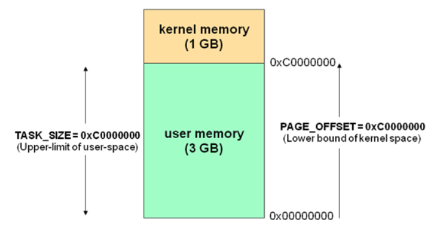

### (f):

- 如图，CR3寄存器指定页目录表的基地址。线性地址的高10位用于索引这个也目录表，以获得指向相关第二级页表的指针。线性地址的中间10位用于索引二级页表，以获得物理地址的高20位。线性地址的低12位直接作为物理地址的低12位，从而组成了一个完整的32位物理地址。

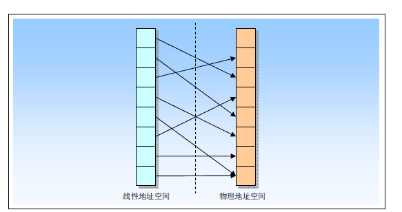

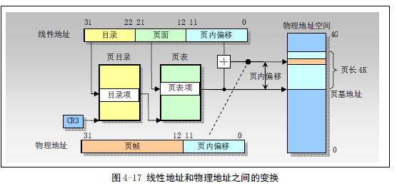

- 上面两个图详细的描述了从线性地址空间到物理地址空间的转换

### (g):

- 进程的表示应该使用`task_struct`进行区分，即每个进程都有它自己的`task_struct`，一般在创建的时候会分配给进程一个进程id，也可通过这个进程id进行区分

  ```c
  struct task_struct {
  /* these are hardcoded - don't touch */
  	long state;	/* -1 unrunnable, 0 runnable, >0 stopped */
  	long counter;	/* 时间片 */
  	long priority;	/* 优先级 */
  	long signal;	/* 以下都是信号相关 */
  	struct sigaction sigaction[32];
  	long blocked;	/* bitmap of masked signals */
  /* various fields */
  	int exit_code;
  	unsigned long start_code,end_code,end_data,brk,start_stack;
  	long pid,father,pgrp,session,leader;
  	unsigned short uid,euid,suid;
  	unsigned short gid,egid,sgid;
  	long alarm;
  	long utime,stime,cutime,cstime,start_time;
  	unsigned short used_math;
  /* file system info */
  	int tty;		/* -1 if no tty, so it must be signed */
  	unsigned short umask;
  	struct m_inode * pwd;
  	struct m_inode * root;
  	struct m_inode * executable;
  	unsigned long close_on_exec;
  	struct file * filp[NR_OPEN];
  /* ldt for this task 0 - zero 1 - cs 2 - ds&ss */
  	struct desc_struct ldt[3];
  /* tss for this task */
  	struct tss_struct tss;
  };
  ```

  ```c
  struct tss_struct {
  	long	back_link;	/* 16 high bits zero */
  	long	esp0;
  	long	ss0;		/* 16 high bits zero */
  	long	esp1;
  	long	ss1;		/* 16 high bits zero */
  	long	esp2;
  	long	ss2;		/* 16 high bits zero */
  	long	cr3;
  	long	eip;
  	long	eflags;
  	long	eax,ecx,edx,ebx;
  	long	esp;
  	long	ebp;
  	long	esi;
  	long	edi;
  	long	es;		/* 16 high bits zero */
  	long	cs;		/* 16 high bits zero */
  	long	ss;		/* 16 high bits zero */
  	long	ds;		/* 16 high bits zero */
  	long	fs;		/* 16 high bits zero */
  	long	gs;		/* 16 high bits zero */
  	long	ldt;		/* 16 high bits zero */
  	long	trace_bitmap;	/* bits: trace 0, bitmap 16-31 */
  	struct i387_struct i387;
  };
  ```
### (h):

- 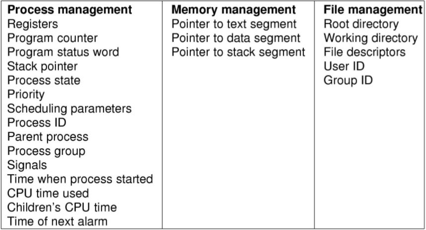

- `LWP`与普通进程的区别也在于它只有一个最小的执行上下文和调度程序所需的统计信息,也就是说在上图的`Memory management`部分`LWP`是共享的

- 与线程相比，`LWP`有它自己的进程标识符，优先级，状态，以及栈和局部存储区， `LWP`只能由内核管理并像普通进程一样被调度，而线程既可由应用程序管理，又可由内核管理

- 有些情况下,也把内核级线程叫做轻量级进程(`LWP`), 但是这个是一个不准备的描述, 其实`LWP`的术语是借自于SVR4/MP和Solaris 2.x系统中, 有些系统将`LWP`称为虚拟处理器, 将之称为轻量级进程的原因可能是, 在内核线程的支持下，LWP是独立的调度单元，就像普通的进程一样。所以LWP的最大特点还是每个LWP都有一个内核线程支持

### (i):

- 进程切换上下文只比切换线程多了一个部分，因为不同进程映射到了不同的地址空间。所以在切换进程的时候需要切换`PCB`中的`ldt`和`cr3`的值，即完成地址空间的切换。但是线程切换的时候不用切换这个，因为一个进程中的多个线程共享了一个地址空间。
- 同时，这两种上下文切换的处理都是通过操作系统内核来完成的。内核的这种切换过程伴随的最显著的性能损耗是将寄存器中的内容切换出。如果是用户级线程的切换，则不需要通过内核，直接在用户空间切换，操作系统甚至都感觉不到
- 线程上下文切换比进程上下文切换快的多。

## 八.进程间的通信与同步

### (a):

- 消息队列( message queue ) ： 

  生命周期随内核，消息队列会一直存在，需要我们显示的调用接口删除或使用命令删除

  消息队列可以双向通信

  克服了管道只能承载无格式字节流的缺点

  1.创建和访问一个消息队列

  ```c
  int msgget(key_t key, int msgflag);
  ```

  2.消息队列的控制函数

  ```c
  int msgctl(int msqid, int cmd, struct msqid_ds *buf); 
  ```

  cmd：有三个可选的值，使用IPC_RMID删除消息队列

  3.把一条消息添加到消息队列中

  ```c
  int msgsnd(int msqid, const void *msgp, size_t msgsz, int msgflg);
  ```

  消息结构一方面必须小于系统规定的上限，另一方面必须以一个long int长整型开始，接受者以此来确定消息的类型

  ```c
  struct msgbuf{
     long mtye;
     char mtext[1];
  };
  ```

  4.从一个消息队列接受消息

  ```c
  ssize_t msgrcv(int msqid, void *msgp, size_t msgsz, long msgtyp, int msgflg);
  ```

  参数：与msgsnd相同

  返回值：成功返回实际放到接收缓冲区里去的字符个数，失败返回-1

- 共享内存( shared memory ) ：共享内存就是映射一段能被其他进程所访问的内存，这段共享内存由一个进程创建，但多个进程都可以访问。共享内存是最快的 IPC 方式，它是针对其他进程间通信方式运行效率低而专门设计的。它往往与其他通信机制，如信号量配合使用，来实现进程间的同步和通信。

  函数

  1. shmget

  功能：用来创建共享内存

  ```c
int shmget(key_t key, size_t size, int shmflg); 
  ```

  shmflg：有两个选项IPC_CREAT和IPC_EXCL，单独使用IPC_CREAT，如果消息队列不存在则创建之，如果存在则打开返回；单独使用IPC_EXCL是没有意义的；两个同时使用，如果消息队列不存在则创建之，如果存在则出错返回。

  2. shmat

  功能：用来将内存段连接到进程地址空间

  ```c
	void *shmat(int shmid, const void *shmaddr, int shmflg);
	```
  
	3. shmdt
  
  功能：将共享内存段与当前进程脱离

	```c
  int shmdt(const void *shmaddr);
	```
	4. shmctl
	
	功能：用于控制共享内存
  ```c
	int shmctl(int shmid, int cmd, struct shmid_ds *buf); 
  ```
  
  cmd:有三个可选的值，使用IPC_RMID删除共享内存段
  
- 套接字( socket ) ： socket，即套接字是一种通信机制，凭借这种机制，客户/服务器（即要进行通信的进程）系统的开发工作既可以在本地单机上进行，也可以跨网络进行。也就是说它可以让不在同一台计算机但通过网络连接计算机上的进程进行通信。也因为这样，套接字明确地将客户端和服务器区分开来。

   套接口编程的几个重要步骤

- 创建套接口，由系统调用socket实现

  ```c
  int socket( int domain, int type, int ptotocol);
  ```

- 绑定地址

  ```c
  int bind( int sockfd, const struct sockaddr* my_addr, socklen_t my_addr_len)
  ```

- 请求建立连接（由TCP客户发起）

  ```c
  int connect( int sockfd, const struct sockaddr* servaddr, socklen_t addrlen)
  ```

- 接受连接请求（由TCP服务器端发起）
	```c
   int accept( int sockfd, struct sockaddr* cliaddr, socklen_t* addrlen)
	```
- 通信

  常用的从套接口中接收数据的调用有：recv、recvfrom、recvmsg等，常用的向套接口中发送数据的调用有send、sendto、sendmsg等。

  通信的最后一步是关闭套接口

  由close()来完成此项功能

### (b):

- 生产者消费者问题：

   ```c
    // 生产者
    do{
       /* produce an item in next produced */
        wait(empty);
        wait(mutex);
       /* add next produced to the buffer*/
        signal(mutex);
        signal(full);
    }while(true);
   ```

    ```C
    // 消费者
    do{
        wait(full);
        wait(mutex);
        /* remove an item from buffer to next consumed */
        signal(mutex);
        signal(empty);
        /* consume the item in next consumed */
    }
    ```

- 作家-读者问题

  ```c
  // 作家
  do{
      wait(rw_mutex);
      /* writing is performed */
      signal(rw_mutex);
  }while(true);
  ```

  ```c
  // 读者
  do{
      wait(mutex);
      read_count++;
      if(read_count == 1)
          wait(rw_mutex);
      signal(mutex);
      /* reading is performed */
      wait(mutex);
      read_count--;
      if(read_count == 0)
          signal(rw_mutex);
      signal(mutex);
  } while(true);
  ```

- 哲学家问题

   ```c
  monitor DiningPhilosophers{
      enum {THINKING, HUNGRY, EATING} state[5];
      condition self[5];
      void pickup(int i){
          state[i] = hungry;
          test(i);
          if(state[i] != EATING)
              self[i].wait();
      }
      void putdown(int i){
          state[i] = THINKING;
          test((i + 4) % 5);
          test((i + 1) % 5);
      }
      void test(int i){
          if((state[(i + 4) % 5] != EATING) && (state[i] == HUNGRY) && (state[i + 1] % 5 != EATING)){
              state[i] = EATING;
              self[i].signal();
          }
      }
      initialization_code(){
          for(int i = 0; i < 5;i++)
              state[i] = THINKING;
      }
  }
  ```

  ```c
  DiningPhilosophers.pickup(i);
  	...
  	eat
  	...
  DiningPhilosophers.putdown(i);
  ```

### (c):

- 互斥锁

  有以下几种方式实现互斥锁：

  1. 严格轮换法，通过一个整形变量`turn`来记录哪个进程进入到临界区，是一种忙等待，称为**自旋锁**
  ```c
     while(TRUE){
     	while(turn != 0)
     	critical_region();
     	turn = 1;
     	noncritical_region();
     }
  ```

     ```
     while(TRUE){
     	while(turn != 1);
     	critical_region();
     	turn = 0;
     	noncritical_region();
     }
     ```

  2. Peterson解法

    ```c
    #define FALSE 0
    #define TRUE 1
    #define N 2
    
    int turn;
    int interested[N];
    
    void enter_region(int process){
    	int other;
      other = 1 - process;
      interested[process] = TRUE;
      turn = process;
      while(turn == process && interested[other] == TRUE);
    }
    
    void leave_region(int process){
      interested[process] = FALSE;
    }
    ```

- 信号量

  可以在内核里面定义一个如下的结构体

  ```c
  typedef struct sem_t{
  	char name[MAX_NAME];
    int value;
    struct task_struct* wait_queue;
  }sem_t
  ```

  可以对其施加两种操作`P`和`V`。这两种操作都是原子操作，对信号量执行`P`操作，是检查其值是否大于0，如果值大于0则将其减1(用掉一个保存的唤醒信号)，如果其值为0，则继续睡眠。如果对信号量执行`V`操作，则对信号量的值加一，如果有一个或多个进程在此信号量上睡眠，则选择一个并允许该进程完成它的`P`操作

- 管程

  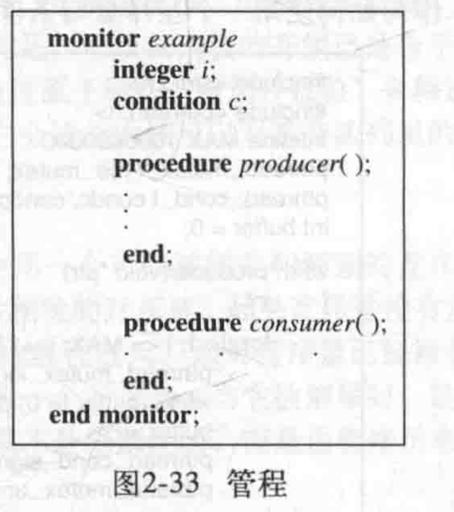

管程的实现可以采用信号量，由于唤醒进程必须等待，直到重新启动的进程离开或者等待，所以引入了一个额外的信号量`next`，唤醒进程可使用`next`来挂起自己。另外还有一个整型变量`next_count`，用于在`next`上挂起的进程进行计数，因此每个外部函数`F`会替换成

```c
wait(mutex);
	...
	body of F
	...
if(next_count > 0)
	signal(next);
else
	signal(mutex);
```

这确保了管城内的互斥。之后我们来描述如何实现条件变量，对于每个条件变量`x`，都有一个信号量`x_sem`和整形变量`x_count`，两者均初始化为0。操作`x.wait()`可如下实现

```c
x_count++;
if(next_count > 0)
	signal(next);
else
	signal(mutex);
wait(x_sem);
x_count--;
```

操作`x.signal()`可按如下实现：

```c
if(x_count > 0){
	next_count++;
	signal(x_sem);
	wait(next);
	next_count--;
}
```

## 九.调度和死锁

### (a):

- 需要进行`CPU`调度的情况有下面四种
  - 当一个进程从运行态切换到等待态
  - 当一个进程从运行态切换到就绪态
  - 当一个进程从等待态切换到就绪态
  - 当一个进程终止时

- 非抢占式调度的概念：

  调度只能发生在上述的第一种和第四种的情况下。否则调度方式就是抢占的
### (b):

- 评价因素有

  1. 吞吐量

     单位时间内CPU完成作业的数量。

  2. CPU利用率

     从0%～100%。

  3. 周转时间

     评价批处理系统的性能指标。

     Ti = 作业完成时刻 － 作业提交时刻

- 在系统角度来说，公平性：每个进程（不论优先级）都有机会被运行；较大的吞吐量。

- 用户角度：及时性：响应速度要快；较短的周转时间：不应当让用户等待时间过长。

  ### (c):

- Windows的调度算法：

  采用基于优先级的、抢占调度算法来调度线程。
  用于处理调度的 Windows 内核部分称为调度程序，Windows 调度程序确保具有最高优先级的线程总是在运行的。由于调度程序选择运行的线程会一直运行，直到被更高优先级的线程所抢占，或终止，或时间片已到，或调用阻塞系统调用（如 I/O）。如果在低优先级线程运行时，更高优先级的实时线程变成就绪，那么低优先级线程就被抢占。这种抢占使得实时线程在需要使用 CPU 时优先得到使用。

  调度程序采用 32 级的优先级方案，以便确定线程执行顺序。优先级分为两大类：可变类包括优先级从 1〜15 的线程，实时类包括优先级从 16〜31 的线程（还有一个线程运行在优先级 0，它用于内存管理）。

  调度程序为每个调度优先级采用一个队列；从高到低检查队列，直到它发现一个线程可以执行。如果没有找到就绪线程，那么调度程序会执行一个称为空闲线程的特别线程。

- Linux的调度算法：

  - FCFS：先到先服务

    即CPU从头到尾按照等待队列执行，其他进程一直看着，称呼护航效果，属于非抢占式的调度

  -  SJF：最短作业优先调度

    会调度下次最短CPU执行的进程（而不是总长度最短），相同就按照FCFS调度。可以式抢占式的，也可以式非抢占形的。

    抢占式:如果当前有一个进程变为就绪态，就要和当前运行的程序进行比较，如果剩余时间更少，则切换

    非抢占式：和上面相比，会等待当前程序运行结束再进行调度

  - 优先级调度

    SJF是优先级调度的一个特例，CPU运行时间越长，则其优先级越低（随着运行时间的使用，其优先级在逐渐变大）

    也可以是抢占的和非抢占的

    问题：无穷等待（老化）

    原因：优先级太低，导致一直无法执行

    解决方法：每间隔一定时间，将所有的阻塞进程（就绪但是由于优先级过低无法执行的状态）的优先级减去1（默认越小优先级越低）

  - RR：轮转调度

    为分时系统设计，类似FCFS算法，定义时间片概念，通常为10~100ms，就绪队列为循环队列，循环调度等待队列中的进程，每个进程分配CPU不多于一个时间片。新进程添加到就绪队列的尾部

    是抢占式的性能取决于时间片的大小，时间片超级大就和FCFS没有什么区别了；小就会有大量的调度，影响性能

  - 多级队列调度

    根据一个进程的重要性以及一些其他的属性，将其划分到一个永久的队列，每一个队列都有不同的调度算法

  - 多级反馈队列调度

    与上面的不同点是一个进程不会永久的待在一个队列中，而是可以根据不同的需求进行反馈

### (d):

- 死锁的概念：一组并发进程不能完成执行任务，当一个进程申请资源时，如果这时没有可用资源，那么这个进程进入等待状态。有事，如果所申请的资源被其他等待进程占有，那么该等待进程有可能再也无法改变状态，这就是死锁。
- 死锁发生的四个条件
  - 互斥
  - 持有且等待
  - 无抢占
  - 循环等待
- 死锁的预防方法
  - 互斥条件必须成立，要保证至少有一个资源是非共享的
  - 保证不出现持有且等待，要保证每个进程申请一个资源时，它不能占有其他资源。一种可采用的协议是：每个进程在执行前申请并获得所有资源，要求进程申请资源的系统调用在所有其他系统调用之前进行
  - 保证无抢占，可采用如下协议：如果一个进程持有资源并申请另一个不能立即分配的资源，那么它现在分配的资源都可被抢占
  - 保证无循环等待，对所有资源类型进行完全排序，而且要求每个进程按递增顺序来申请资源
- 死锁的避免方法
  - 可采用资源分配图算法
  - 采用银行家算法
- 死锁的检测方法
  - 可使用等待图
  - 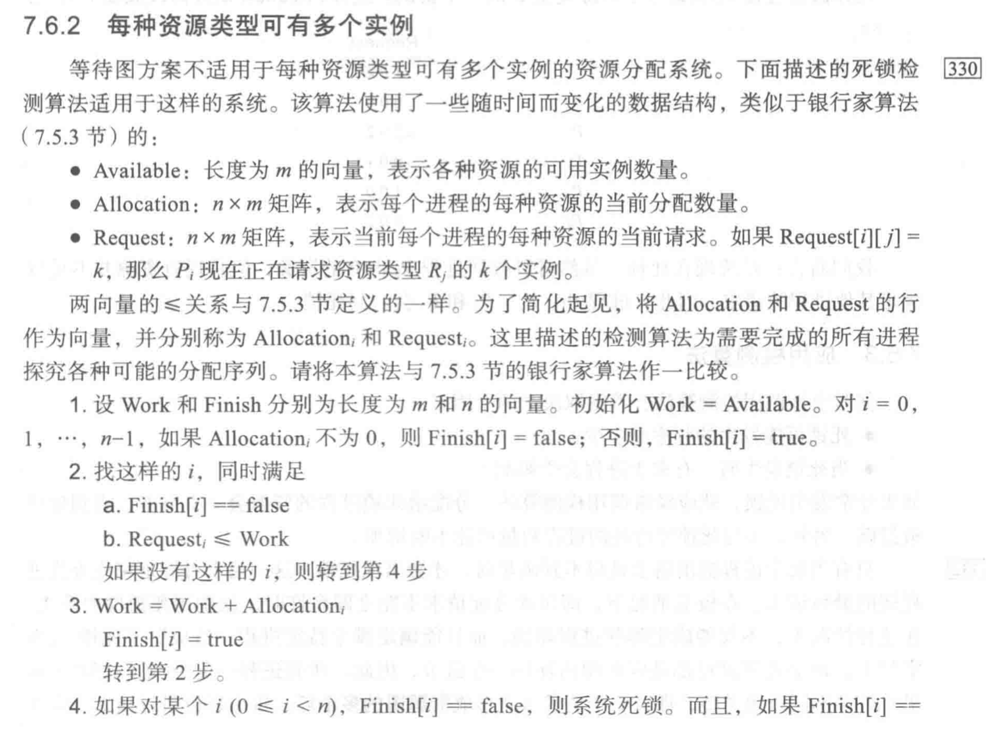
- 死锁的恢复方法
  - 中止所有死锁进程
  - 一次中止一个进程，直到消除死锁循环为止

## 十.内存管理

### (a):

- 局部性分为时间局部性和空间局部性

  由于程序在内存中的表现形式为分段形式，即程序段，代码段，栈等。由于进程在执行的过程中是通过CPU不断的都从程序段中取出指令，所以一些最近的指令会集中在一起。 

-  当一个函数被调用时，它就定义了一个新的局部。在这个局部里，内存引用课针对函数调用的指令、它的局部变量以及全局变量的某个子集。当退出函数时，进程离开该局部，因为这个函数的局部变量和指令已不再处于活动使用状态。  

- 一个程序大部分的时间都在用于循环。循环体如果不断的访问一个数组，将一个数组赋值给返回值a。由于代码集中在一个代码段中，CPU会连续的在这个循环体中执行指令，所以会集中的去访问数组的内存单元。而由于数据段的存在，且数组储存形式是连续的，所以数组的内容会在数据段中连续的存访，所以近期访问数据段的位置会很相近，在数据段中的某一部分，这就体现了空间的局部性；而一直对EAX寄存器的访问则体现了时间的局部性。

### (b):

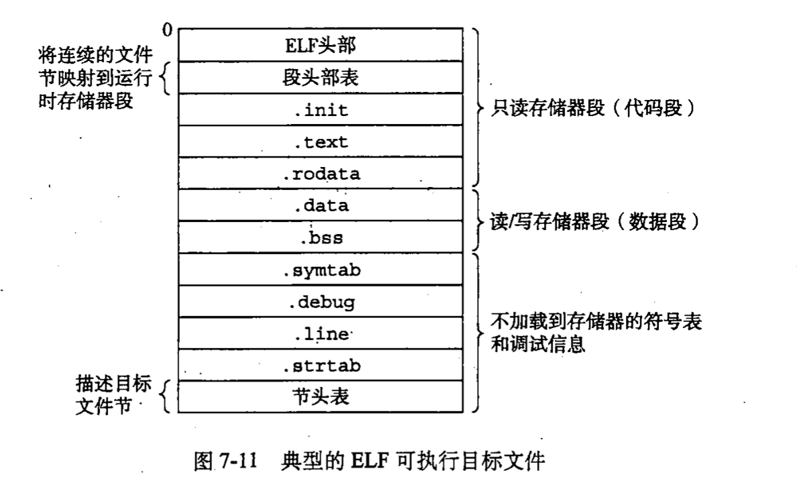


- 虚拟内存：每个程序拥有自己的地址空间，这个空间被分割成多个块，每一块称作一页或页面，每一页有连续的地址范围。这些页被映射到物理内存，但不是所有的页都必须在内存中才能运行程序。当程序引用到一部分在物理内存中的地址空间时，由硬件立刻执行必要的映射。当程序引用到一部分不在物理内存中的地址空间时，由操作系统负责将缺失的部分装入物理内存并重新执行失败的指令

### (c):

- 请求调页：仅在需要时才加载页面

- 缺页中断：

  - 对标记为无效的页面访问会产生缺页错误。分页硬件在通过页表转换地址时会注意到无效位被设置，从而陷入操作系统未能将所需的页面调入内存引起的陷阱。任何内存引用都可能引起缺页错误。
  - 实现方法和运行过程：如果在获取指令时出现缺页错误，那么可以再次获取指令。如果在获取操作数时出现了缺页错误，那么可以再次获取指令、再次译码指令，然后再次获取操作数。

- 处理缺页错误的程序：

  - 检查这个进程的内部表（通常与进程控制块PCB一起保存），以确定该引用是有效的还是无效的内存访问。
- 如果引用无效，那么终止进程。如果引用有效但是尚未调入页面，那么现在就应调入。
  - 找到一个空闲帧
- 如果没有空闲帧就用页面置换算法来选择以牺牲帧。将牺牲帧的内容写到磁盘上，修改页表和帧表。
  - 调度一个磁盘操作，以将所需页面读入刚分配的帧。
- 当磁盘读取完成时，修改进程的内部表和页表，以指示该页现在处于内存中。
  - 重新启动被陷阱中断的指令，该进程现在能访问所需的页面，就好像它总是在内存中

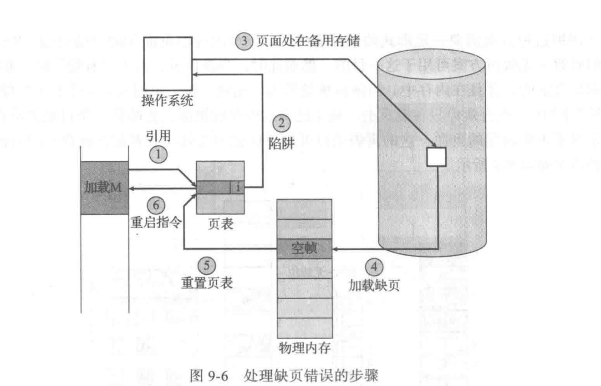

- 交换空间

  外存用于保存不在内存中的那些中的那些页面。外村通常为高速硬盘，称为交换设备。用于交换的这部分磁盘称为交换空间。  

- 页替换算法

  如果没有空闲帧，那么就查找当前不在使用的一个帧，并释放它。将要释放帧的内容写到交换空间，并修改页表，以表示该页不在内存中。现在可使用空闲帧，来保存进程出错的页面

  - FIFO算法。选择调到内存时间最旧的页面

  - 最优页面置换算法MIN/OPT：置换最长时间不会使用的页面。

  - LRU页面置换：最近最少使用算法。

  - LFU最不经常使用

  - MFU最经常使用

-  交换过程

   - 找到所需页面的磁盘位置
   -  找到一个空闲帧
   - 如果有空闲帧，就使用它
      - 如果没有空闲帧，那么使用页面置换算法来选择一个牺牲帧
      - 将牺牲帧的内容写到磁盘上，修改对应的页表和帧表
   - 将所需页面读入新的空闲帧，修改页表和帧表
   - 从发生缺页错误位置，继续用户进程
   
   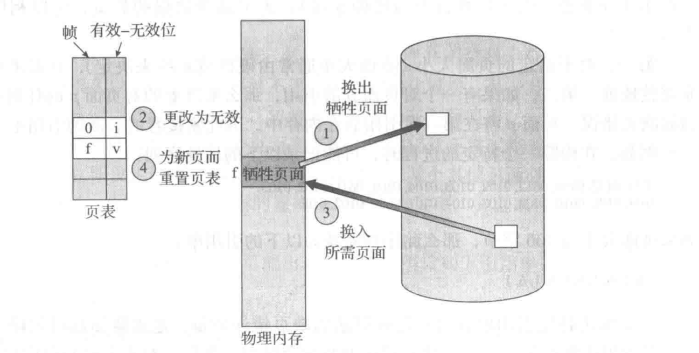
   
- 系统抖动：

   高度的页面调用活动，如果进程没有需要支持活动使用页面的帧数，那么它会很快产生缺页错误。此时必须置换某个页面。然而，由于他所有页面都在使用中，所以必须立即置换需要再次使用的页面。因此它会再次快速产生缺页错误。

- 工作集

   工作集模型是基于局部性假设的。这个模型采用参数Δ顶级工作集窗口。它的思想是检查最近Δ个页面引用的页面集合称为工作集。如果一个页面处于活动使用状态，那么它处在工作集中。如果它不再使用，那么它在最后一次禁用的Δ时间单位后，会从工作集中删除。因此工作集是程序局部的近似。

   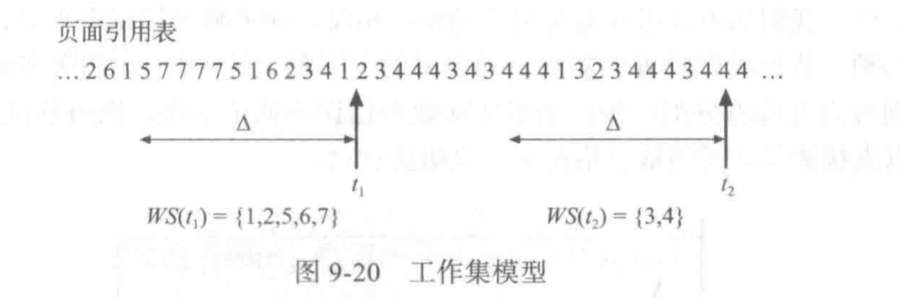

### (d):

- 分配：

  操作系统根据所有进程的内存需求和现有可用内存的情况，决定哪些进程可分配内存。当进程分配到空间时，它就加载到内存，并开始竞争CPU。当进程终止时，它会释放内存，该内存可被操作系统分配给输入队列内的其他进程

  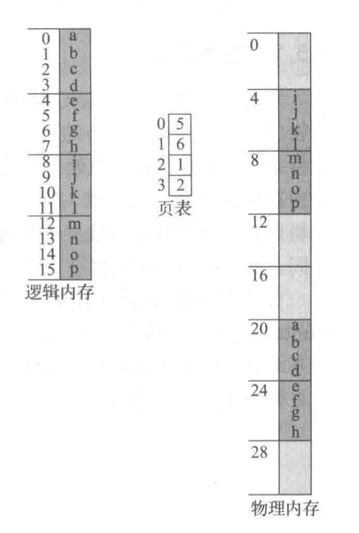

- 回收：

  用户进程的页面都是通过page fault进行分配的。通过page fault进行分配的页面都是可以进行回收的。 这些页面总体可以划分为两种，分别是文件页(file cache)和匿名页(anonymous cache). 文件页，顾名思义，它是和外部存储设备上的某个文件相对应。匿名页，其内容不来自于外部存储设备，例如用户进程中的堆栈。这两种页面是内存回收的目标页面。内存回收采用的主要算法是近似于LRU的算法。