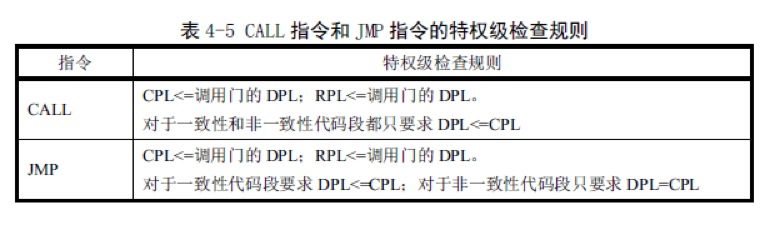
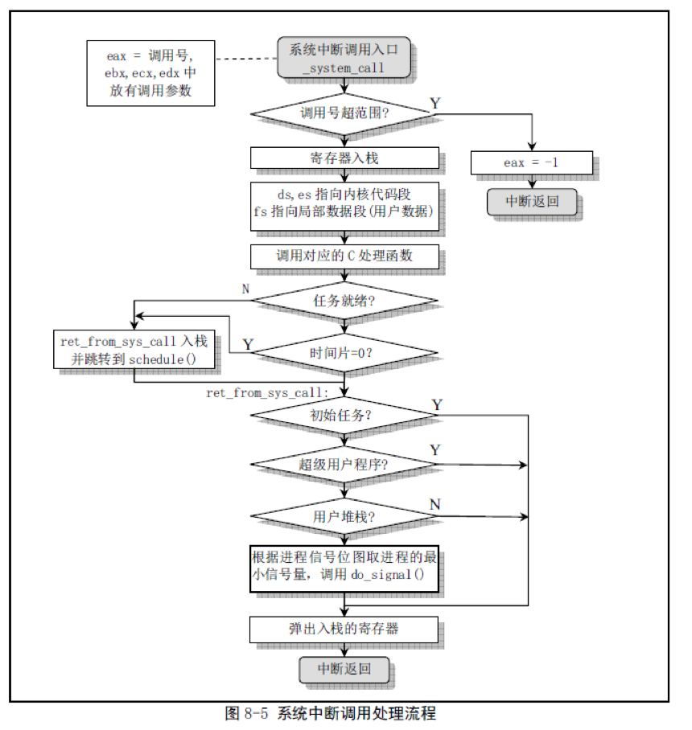
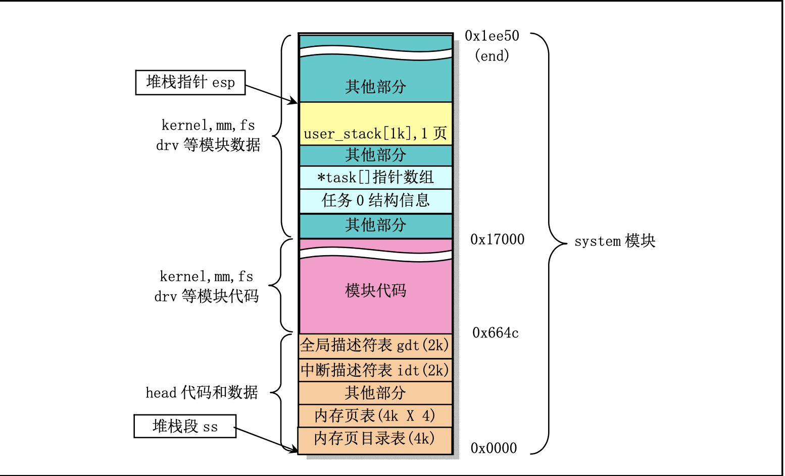
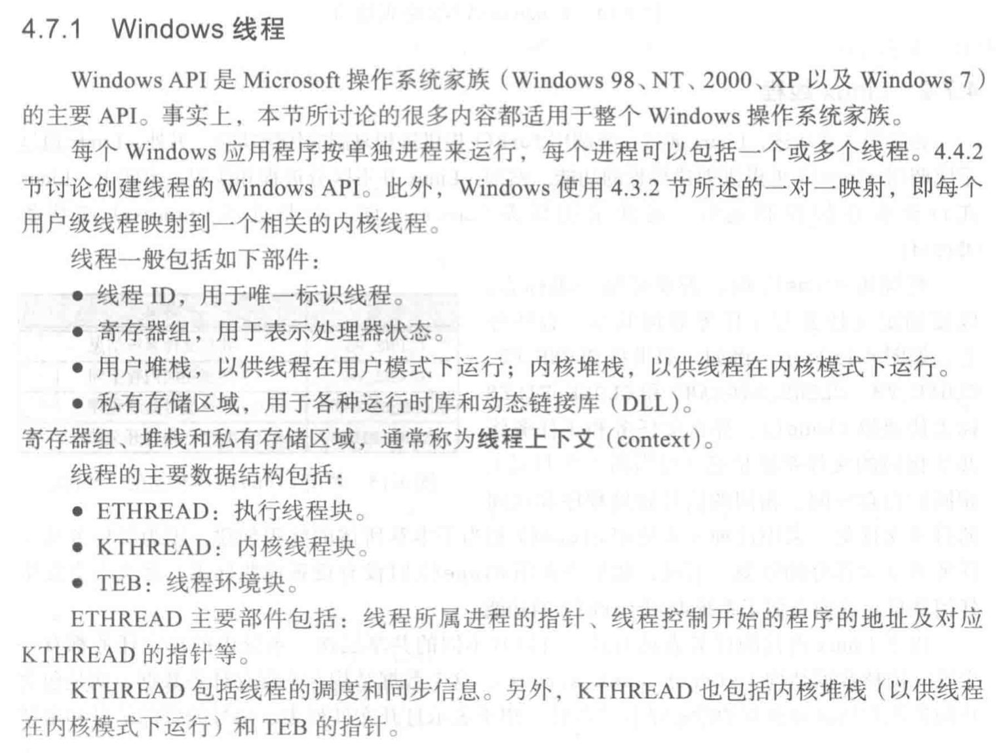
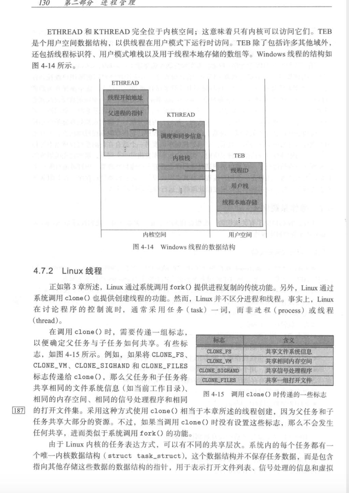

# 一.单CPU模式单任务单函数

### (a):

- CPU的通用寄存器有：AX,BX,CX,DX这四个。

- 段的概念：因为8086CPU有20位地址总线，但是8086CPU又是16位结构，所以我们采取了用两个16位地址合成的方法来形成一个20位的物理地址。一个叫段地址，另一个叫偏移地址。但是实际上内存并不是分段的，我们只是可以用分段的方式来管理内存，在编程时根据需要可以将若干地址连续内存单元看成一个段。

- CS,DS,SS的作用：这三个都是段寄存器，当8086CPU要访问内存时由这四个段寄存器提供内存单元的段地址。其中一般CS用来指向代码段，DS用来指向数据段，SS用来指向栈段。

- CPU是如何从内存存取到指令的：

  - 首先将CS,IP中的内容送入地址加法器，完成到物理地址的转换
  - 地址加法器将物理地址送入输入输出控制电路
  - 输入输出控制电路将物理地址送上地址总线
  - 之后从内存里存放的指令通过数据总线被送入CPU

  这样CPU就从内存里取到了指令

### (b):

- 在mov指令中给出16位的寄存器就可以进行16位数据的传送了。比如从寄存器到内存：`mov ax,[0]`，从内存到寄存器：`mov [0],ax`，从寄存器到寄存器：`mov ax, bx`。不能实现从内存到内存的数据复制。必须通过一个寄存器作为中转。在(a)中已经大概说明了总线以及寻址方式的概念

### (c):

- 程序地址：就是由段地址：偏移地址二者构成的逻辑地址
- 物理地址：真正在物理内存中的地址，通过物理地址可以访问到我们想要的数据
- 段的概念(a)中已解释过
- 链接的概念：将所有的目标文件进行合并，所有目标文件的数据段合并到可执行文件的数据段，所有目标文件的代码段合并到可执行文件的代码段。当所有合并完成后，各个目标文件中的相对地址也就确定了。因此在这个阶段，链接器需要修正目标文件中的相对地址。

### (d):

- 可以实现对端口的读写，进而可以进行比如说对键盘系统进行相关的控制，比如从60h端口读入键盘输入的信息。还可以通过向接口写入相关信息，控制比如说网卡，显卡的工作。

- 端口的概念：在我们的PC机系统中，和CPU通过总线相连的芯片除了各种存储器外还有以下三种芯片

  - 各种接口卡上的接口芯片，它们控制接口卡进行工作
  - 主板上的接口芯片，CPU通过它们对外部设备进行访问
  - 其它芯片，用来存储相关的系统信息，或进行相关的输入输出处理

  这些芯片上都有一组可以由CPU读写的寄存器，从CPU的角度讲这些寄存器都当作端口，对它们进行统一编制。

- 控制器：控制器负责程序的流程管理，其基本功能是从内存取指令、分析指令和执行指令，常见的控制器有中断控制器，键盘控制器等。

### (e):

- 中断，异常的概念：CPU不再接着刚执行完的指令向下执行，而是转去处理接收到的特殊信息。这个特殊信息要求CPU马上进行某种处理，并向所要进行的该种处理提供了必备的参数的通知信息。异常和中断的区别在于异常是不是随机产生的，而中断是任何时间都有可能发生的，也就是说中断是不可复现的，异常是可复现的
- 中断，异常的作用：可以说操作系统是中断驱动的。中断和异常可以:
  - 提高计算机系统效率。计算机系统中处理机的工作速度远高于外围设备的工作速度。通过中断可以协调它们之间的工作。当外围设备需要与处理机交换信息时，由外围设备向处理机发出中断请求，处理机及时响应并作相应处理。不交换信息时，处理机和外围设备处于各自独立的并行工作状态。
  - 维持系统可靠正常工作。现代计算机中，程序员不能直接干预和操纵机器，必须通过中断系统向操作系统发出请求，由操作系统来实现人为干预。主存储器中往往有多道程序和各自的存储空间。在程序运行过程中，如出现越界访问，有可能引起程序混乱或相互破坏信息。为避免这类事件的发生，由存储管理部件进行监测，一旦发生越界访问，向处理机发出中断请求，处理机立即采取保护措施。
  - 满足实时处理要求。在实时系统中，各种监测和控制装置随机地向处理机发出中断请求，处理机随时响应并进行处理。
  - 提供故障现场处理手段。处理机中设有各种故障检测和错误诊断的部件，一旦发现故障或错误，立即发出中断请求，进行故障现场记录和隔离，为进一步处理提供必要的依据。

# 二.单CPU模式单任务多函数

### (a):

- 参数传递：调用函数通过寄存器来传递，调用者将参数送入相应的寄存器，如果这个寄存器之后还要使用，则要把它保存在栈上。然后被调用者通过从寄存器中去到参数，再把返回值压到相应寄存器中返回。

- 栈里面还存放着调用时的`cs`，`ip`寄存器的值。函数B运行完成后，通过`pop`栈上存放的`cs`，`ip`寄存器的值，将寄存器`cs`,`ip`指向的命令设置为调用命令的下一条指令

- `call xxx:xxx`相当于执行以下语句序列

  ```assembly
  push CS
  push IP
  jmp dword ptr 内存单元地址
  ```

  执行一个段间转移，和`jmp`的区别就在于在栈里保存了`cs`,`ip`寄存器的值

- 用了`SS`,`SP`,`BP`这几个寄存器

- 首先执行`call`，向栈中压入了`cs`,`ip`两个寄存器，之后将`cs`和`ip`的值修改，之后一步步执行指令，执行到`ret`时将`ip`和`cs`弹出栈

### (b):

- 可以传递，方式和普通函数调用一样
- 正常就是使用一个栈

### (c):

- 可以传递，方式和普通函数调用一样
- 正常就是一个栈

### (d):

- 可以用一个栈，因为题目只是要求按下B的时候运行函数B，并没有要求是接着上一次进行。这样可以直接按照嵌套的函数调用来理解，即是一个嵌套的栈段

# 三.单CPU模式多(线程)任务

### (a):

- 不能共用一个栈了。设想，如果共用一个栈，当前在运行A函数，A call了一个print函数，此时sp指向返回地址（call压栈返回地址）了。这时候按下B键，程序应当切换到B函数，B也call了一个print，然后这时候按下了A键，切换到A运行，A应该接着运行print，那么A从print返回的地址是不是正确的  

- 至少需要三个栈，每个函数用一个栈，还有一个入口栈

- 因为寄存器只有一套，毫无疑问切换到B的时候我们需要保存A的寄存器，然后从某个地方载入B的寄存器内容。重新运行A的时候，使用保存的寄存器值还原A的运行场景，即回到A被中断的那一瞬间，从而恢复运行A，好像A没有被打断一样。

  故我们需要保存2套寄存器，从而可以使得AB可以任意的来回切换。但我们怎么知道要不要切换呢，比如按下A的时候正在运行A，这时候是不必切换的，所以我们引入一个参数，记录当前正在运行的程序。

  具体分析中断处理例程的场景，首先根据按键，决定要不要切换。如果要切换的话，我们首先得保存一下寄存器，即快照，我们叫它 **save_all** 。然后恢复目标函数的运行快照，切换的工作是用一个叫**switch**的函数完成。不考虑细节的话，我们已经成功的做出来了这个程序，完美的符合要求。

  现在来探讨一些细节的东西，从 **save_all** 开始，首先我们根据按键找到储存的地方（两个函数有两个储存的地方），接下来就简单了，我们把寄存器挨个放进去就好了。

  **switch**也很简单，无非是找到储存的地方，然后修改现有的寄存器就行，这不就切换成功了么。

  我们再整理一下整体逻辑，递增程序开始运行后，运行某个函数。按下指定键时，中断例程使用save_all保存现场，然后使用switch切换到其他函数，其中包括栈的切换（通过修改ss sp完成）。然后我们就实现了两个函数无缝切换

### (b):

- 因为我们每个函数分别使用了一个栈，在函数进行切换的时候我们随机进行了栈的切换，我们在切换到另一个函数前会把当前的`CS`,`IP`压栈，这样在切换回来以后我们可以把栈里面存放的`CS`和`IP`给弹出来，这样就恢复了之前的执行状态
- A运行时发生中断，运行C，这个时候会把标志寄存器，`CS`,`IP`压入A的栈里面，然后我们在中断处理程序中将`SS:SP`切换为B的栈的，然后在把B的栈中存放的`CS`,`IP`给弹出来，这样就切换到了函数B执行

### (c):

- 是两个线程，因为他们有各自的栈和运行序列，但是因为是实模式，所以他们可以说是共享了同一份地址空间。我认为线程就是有自己的栈，有自己的寄存器上下文，但是其它大部分资源与其它线程共享此进程中的全部系统资源

- 需要做如下操作

  - 首先要申请一段内存空间(一页)
  - 创建一个`TCB`数据结构
  - 将`TCB`中的内核栈和用户栈指针分别指向相应的位置，其中内核栈在申请的页的最高地址处，用户栈与父进程共用
  - 之后将栈和`TCB`关联起来

  我认为`TCB`可以做成把一个`PCB`去除掉它的`ldt`和`cr3`以后的结构。也就是说关于内存的映射方面全都删去，这样就不用考虑不同进程的地址空间隔离的问题

- 想要退出线程的话，可以参考进程的`exit`，步骤如下

  ```c
  int sys_endthread(long code)  
  {
          int i;
  	free_page_tables(get_base(current->ldt[1]),get_limit(0x0f));
  	free_page_tables(get_base(current->ldt[2]),get_limit(0x17));
  	for (i=0 ; i<NR_TASKS ; i++)
  		if (task[i] && task[i]->father == current->pid) {
  			task[i]->father = 1;
  			if (task[i]->state == TASK_ZOMBIE)
  				/* assumption task[1] is always init */
  				(void) send_sig(SIGCHLD, task[1], 1);
  		}
  	for (i=0 ; i<NR_OPEN ; i++)
  		if (current->filp[i])
  			sys_close(i);
  	iput(current->pwd);
  	current->pwd=NULL;
  	iput(current->root);
  	current->root=NULL;
  	iput(current->executable);
  	current->executable=NULL;
  	if (current->leader && current->tty >= 0)
  		tty_table[current->tty].pgrp = 0;
  	if (last_task_used_math == current)
  		last_task_used_math = NULL;
  	if (current->leader)
  		kill_session();
  	current->state = TASK_ZOMBIE;
  	current->exit_code = code;
  	tell_father(current->father);
  	release(current);
  	return (-1);	/* just to suppress warnings */
  }
  ```

### (d):
- 构建临界区：通过使用比如信号量等同步手段，保证一次只有一个进程进入这段代码

- 条件：

  - 互斥进入
  - 空闲进入
  - 有限等待
### (e):
- **互斥锁**：互斥锁是一种简单的加锁的方法来控制对共享资源的访问，互斥锁只有两种状态,即上锁( lock )和解锁( unlock )

  **信号量**：信号量本质上是一个非负的整数计数器，它被用来控制对公共资源的访问。编程时可根据操作信号量值的结果判断是否对公共资源具有访问的权限，当信号量值大于 0 时，则可以访问，否则将阻塞。PV 原语是对信号量的操作，一次 P 操作使信号量减１，一次 V 操作使信号量加１。

  **条件变量**：条件变量是线程的另外一种同步机制，这些同步对象为线程提供了会合的场所，理解起来就是两个（或者多个）线程需要碰头（或者说进行交互-一个线程给另外的一个或者多个线程发送消息），我们指定在条件变量这个地方发生，一个线程用于修改这个变量使其满足其它线程继续往下执行的条件，其它线程则接收条件已经发生改变的信号。条件变量同锁一起使用使得线程可以以一种无竞争的方式等待任意条件的发生。所谓无竞争就是，条件改变这个信号会发送到所有等待这个信号的线程。而不是说一个线程接受到这个消息而其它线程就接收不到了。

# 四.双CPU模式单进程空间

### (a):

- 设置四个运行级的目的：可以利用特权级的比较来防止在低特权级的程序或任务访问具有较高特权级的一个段。比如操作系统代码和数据存放在要比普通应用程序具有更高特权级的段中操作系统的代码和数据。这样就在一定程度上保护了操作系统内核的代码和数据不会被随意修改。
- 为什么操作系统值用了两个运行级别：因为区分用户态和内核态就够了，多的特权级可能帮助并不是很大

### (b):

- `CS`,`DS`,`SS`这些段寄存器的可见部分中存着目标段的段选择符。然后`LDTR`的可见部分存放的也是段选择符。我们通过`LLDT`指令可以将段选择符加载到`LDTR`寄存器中
- GDT和LDT中描述符的区别：LDT中的都是特权级为3的段的段描述符，而GDT中有特权级为0的段的段描述符，并且还有中断门，调用门，陷阱门以及LDT的描述符

### (C):

- 如果没有进行段的映射，那么有可能内核空间的段可以被用户程序访问。这样用户程序就有可能可以修改内核的数据和代码，就没有起到保护。

### (d):

- 第一种方式的优点：只有一张`GDT`表，那么在切换进程以后也不用切换`LDT`了，因为所有的映射关系都存在一张表里面。但是如果都存在一个表里面一个进程就可以轻松的访问另一个进程的段，如果都是用户进程的话，他们的`CPL`和`DPL`都是3，无法进行保护，并且只用一个`GDT`表的话这个`GDT`表会非常大，难以维护
- 第二种方式的优点，一个进程通过自己的`LDT`表只能找到本进程的段，找不到其他进程的段。这样就在一定程度上实现了进程之间的隔离

### (e):

- 对于第一种方案，没有别的方法只能增加到`GDT`中，因为只有`GDT`.....
- 第二种方案应该在内核栈空间的栈段的描述符放在`GDT`中，用户空间的栈段的段描述符放在`LDT`中。

### (f):

- CPL是当前正在执行程序或任务的特权级

  DPL是描述符特权级，是一个段或门的特权级

            

  处理器利用特权级防止运行在较低特权级的程序或任务访问具有较高特权级的一个段，除非是在受控条件下。当处理器检测到一个违反特权级的操作时，他就会产生一个一般保护性异常。

## 五.双CPU模式单进程空间单线程

### (b):

- 堆栈切换

  1. 使用新的`CPL`从`TSS`中选择新栈的指针，从当前`TSS`中读取新栈的段选择符和栈指针。
  2. 检查栈段描述符特权级和类型是否有效
  3. 临时保存`SS`和`ESP`寄存器的当前值，把新栈的段选择符和栈指针加载到`SS`和`ESP`中，把临时保存的`SS`和`ESP`内容压入新栈中
  4. 把调用门描述符中指定参数个数的参数从调用过程栈复制到新栈中
  5. 把当前`CS`和`EIP`内容压入新栈，把新代码段选择符加载到`CS`中，同时把新的指令指针加载到`EIP`中，再开始执行被调用代码

- 系统调用

  用户使用中断调用int 0x80和放在寄存器eax中的功能号来使用内核提供的各种功能服务，这种服务叫做系统调用

  实现方式：调用int 0x80和功能号放在寄存器eax中  

  

1. 检查eax中的功能号是否有效，然后保存一些寄存器到堆栈上。Linux默认dx es用于内核数据段，而段寄存器fs用于用户数据段。接着通过一个地址跳转表sys_call_table调用相应系统调用的C函数。C函数返回之后，程序把返回值压入堆栈保存起来
2.  该程序检查本次调用进程的状态。如果由于上面C函数的操作或其他情况而使进程的状态从执行态变成了其他状态，或者由于时间片已经用完（counter==0），则调用进程调度函数schedule()(jmp_schedule)。由于在执行“jmp_schedule”之前已经把返回地址ret_from_sys_call入栈，所以再执行完shedule()后最终返回到ret_from_sys_call处继续执行
3.  从ret_from_sys_call标号处开始的代码执行一些系统调用的后处理过程。主要判断当前进程是否是初始进程0，如果是就直接退出本次系统调用，中断返回。否则再根据代码段描述符和所使用的堆栈来判断本次调用的进程是否是一个普通进程，否则为内核进程或其他。则也立刻弹出堆栈内容退出系统调用中断。末端的一块代码用来处理调用系统调用进程的信号。若进程信号位图表明该进程有收到信号，则调用信号处理函数do_signal()。
4.  恢复保存的寄存器的内容，退出此次中断处理过程并返回调用程序。若有信号时则先处理信号，然后返回调用sys_call的程序

### (c):

- 堆栈切换的过程在(b)中已经说过了

- 运行级别会从用户态运行级别(`CPL=3`)切换到内核态运行级别(`CPL=0`)

- 切换过后内存空间要切换到相应的内核空间，比如内核的数据段代码段的描述符就不是在对应进程的`LDT`中了，而是存放在`GDT`中。并且还会切换页表，页表不存放在主存空间了，而是在紧接着页目录的四个页表项。

  

## 六.双CPU模式单进程空间多线程

### (a):

- TCB可以做成把一个`PCB`去除掉它的`ldt`和`cr3`以后的结构。也就是说关于内存的映射方面全都删去，这样就不用考虑不同进程的地址空间隔离的问题

- 切换过程：

  1. 首先切换`TCB`

  2. 重写`TSS`,使得(切换后的内核栈指针正确，可以进行再次中断切换)

  3. 内核栈指针的重写
### (b):

创建和中止纯内核函数。`TCB`应该设计成什么样已经写过很多次了，这里不再写了

  ```c
  int sys_endthread(long code)  
  {
          int i;
  	free_page_tables(get_base(current->ldt[1]),get_limit(0x0f));
  	free_page_tables(get_base(current->ldt[2]),get_limit(0x17));
  	for (i=0 ; i<NR_TASKS ; i++)
  		if (task[i] && task[i]->father == current->pid) {
  			task[i]->father = 1;
  			if (task[i]->state == TASK_ZOMBIE)
  				/* assumption task[1] is always init */
  				(void) send_sig(SIGCHLD, task[1], 1);
  		}
  	for (i=0 ; i<NR_OPEN ; i++)
  		if (current->filp[i])
  			sys_close(i);
  	iput(current->pwd);
  	current->pwd=NULL;
  	iput(current->root);
  	current->root=NULL;
  	iput(current->executable);
  	current->executable=NULL;
  	if (current->leader && current->tty >= 0)
  		tty_table[current->tty].pgrp = 0;
  	if (last_task_used_math == current)
  		last_task_used_math = NULL;
  	if (current->leader)
  		kill_session();
  	current->state = TASK_ZOMBIE;
  	current->exit_code = code;
  	tell_father(current->father);
  	release(current);
  	return (-1);	/* just to suppress warnings */
  }
  
  ```

  ```c
  int pthread_create(pthread_t *thread,const pthread_attr_t* attr,void* (*start_routine)(void *),void* arg)
  {
  	pthread_t thread_id;
  	
  	if(thread == NULL || start_routine == NULL)
  	{
  		printf("Error:Thread or func_addr is NULL!!!\n");
  		exit(0);
  	}
  
  	if(attr != NULL && attr->stacksize > PAGE_SIZE)
  		return EINVAL;
  	
  	thread_id = thread_fork(attr,start_routine,arg);
  	if(thread_id == -1)
  	{
  		printf("Error:New thread creating failed!!!\n");
  		return errno;
  	}
  
  	if(thread_id > 0)
  	{
  		(*thread) = thread_id;
  		return 0;
  	}
  
  	printf("Error:pthread_create error!\n");
  	return -1;
  }
  ```

### (c):

用户线程`TCB`的创建，中止和调度函数

### (d):

- 它们系统调用时，进入内核后，就没有TCB能代表他们了，因为TCB在用户空间。因此进入内核后，只能用PCB，A、B是共享这个PCB的。信号处理是要用到进程的PCB的，因此需要看看这时的PCB允不允许信号处理运行。
- 这道题答案是不能，因为磁盘的 write 系统调用不能被打断

### (e):

- 可以使用一对一模型或者多对多模型，将一个用户线程与一个或者多个`PWD`相关联，这样在一个用户线程阻塞的时候B依然还能做系统调用

- 不同线程模型的异同和优缺点：

  纯用户线程：

  1. 允许有自己定制的调度算法
  2. 有更好的性能
  3. 但是如果一个线程执行系统调用，该进程的其他线程就不能进行系统调用

  多对一：

  1. 一个线程执行系统调用时其他线程不能执行
  2. 调度可以由内核做

  一对一：

  1. 一个线程执行一个系统调用时此进程的其他线程也可以执行系统调用
  2. 创建的线程数不能太多，绑定的`PWD`数量有限

  多对多：

  1. 综合了以上，一定程度上平衡和解决了阻塞和`PWD`数量的问题

### (f):

- Windows

  

- Linux

  

